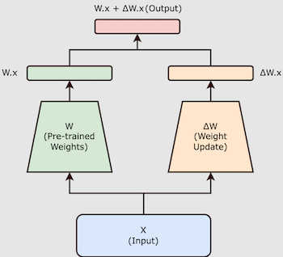
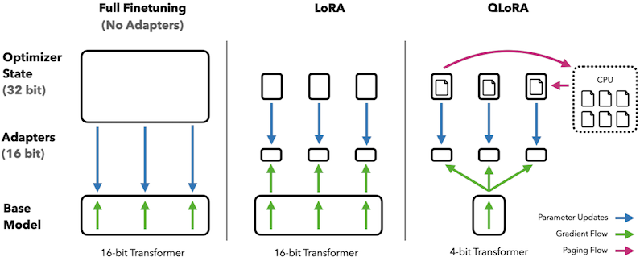

# **Proyecto Fine-Tuning Image**

Este repositorio proporciona una **imagen Docker** preconfigurada con todas las dependencias necesarias para aplicar técnicas de **PEFT** (Parameter-Efficient Fine-Tuning) sobre modelos de lenguaje de última generación. El objetivo principal es facilitar un entorno reproducible y listo para usar, donde puedas experimentar y desplegar entrenamientos eficientes sin preocuparte por la instalación manual de librerías.

## Técnicas PEFT soportadas
### **LoRA** (Low-Rank Adaptation)

**LoRA** introduce matrices entrenables de bajo rango paralelas a las capas lineales del modelo.
Durante el entrenamiento, se actualizan únicamente estas matrices, mientras que los pesos del modelo base
permanecen congelados, reduciendo significativamente el consumo de recursos durante el entrenamiento.


- Edward Hu, Yelong Shen, Phillip Wallis, Zeyuan Allen-Zhu, Yuanzhi Li, Shean Wang & Weizhu Chen. (2021).
  [**Low-Rank Adaptation of Large Language Models**](https://arxiv.org/abs/2106.09685)

### **QLoRA** (Quantized LoRA)
**QLoRA** combina cuantización a 4 bits del modelo base con LoRA para permitir el ajuste fino de LLMs grandes
en hardware de consumo. La arquitectura cuantiza las matrices originales usando técnicas como NF4 (NormalFloat 4-bit)
y entrena matrices de bajo rango adicionales, preservando precisión mientras reduce drásticamente
el uso de memoria.



- Dettmers, T., Pagnoni, A., Holtzman, A., & Zettlemoyer, L. (2023). [**QLoRA: Efficient Finetuning of Quantized LLMs**](https://arxiv.org/abs/2305.14314).

### TODO
- **BitFit**  
- **Prefix Tuning v2**  
- **IA³** (Injected Attention Adapter)

### Modelos compatibles

- **GPT-2**  
- **LLaMA 7B**

### Características principales

1. **Entorno aislado**  
   La imagen Docker incluye Python 3.x y todas las librerías (Transformers, Accelerate, BitsAndBytes, PEFT, etc.) necesarias para correr tus scripts de fine-tuning.

2. **Optimización de recursos**  
   Configuraciones por defecto orientadas a entrenamiento en GPU, con soporte para cuantización y bajo uso de memoria.

3. **Reproducibilidad**  
   Versión fija de cada dependencia para garantizar que tus experimentos sean consistentes y fácilmente replicables.

## **Prerrequisitos**
* `make` instalado
* Docker instalado y configurado para usar GPUs (NVIDIA Docker).
    * [Installing the NVIDIA Container Toolkit](https://docs.nvidia.com/datacenter/cloud-native/container-toolkit/latest/install-guide.html)
    * [Install Docker Engine on Ubuntu](https://docs.docker.com/engine/install/ubuntu/)


* Token de Hugging Face para acceder a repositorios con acceso restringido:

```
export HUGGINGFACE_TOKEN=<tu_token_HF>
```

---

## **Estructura**

* **Dockerfile**: Define la imagen base con dependencias (transformers, peft, etc.).

* **lora.py**: Implementación en python para aplicar LoRA/QLoRA en modelos LLM.

* **Makefile**: Simplifica la construcción de la imagen y la ejecución del contenedor.

---

## **Uso con Make**

### **1\. Construir la imagen**

```
make build
```

### **2\. Ejecutar el contenedor**

Para entrenar/ejecutar dentro del contenedor, debes proporcionar dos variables:

* `PEFT`: tecnica peft a aplicar (`lora`,`qlora`, ...)

* `MODEL`: modelo a usar (`gpt-2` o `llama-7b`).

```
make run PEFT=lora MODEL=gpt-2
```
