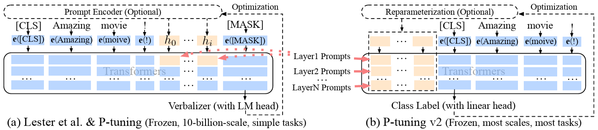
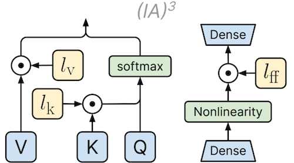

# **Proyecto Fine-Tuning Image**

Este repositorio proporciona una **imagen Docker** preconfigurada con todas las dependencias necesarias para aplicar técnicas de **PEFT** (Parameter-Efficient Fine-Tuning) sobre modelos de lenguaje de última generación. El objetivo principal es facilitar un entorno reproducible y listo para usar, donde puedas experimentar y desplegar entrenamientos eficientes sin preocuparte por la instalación manual de librerías.

## Modelos LLM soportados

- **[GPT-2](https://huggingface.co/gpt2)**  
  Modelo autoregresivo de lenguaje desarrollado por OpenAI, conocido por su arquitectura Transformer y entrenado en una gran cantidad de datos de internet. Es ampliamente utilizado como baseline para tareas de generación de texto.

- **[LLaMA 7B](https://huggingface.co/meta-llama/Llama-2-7b-hf)**  
  Modelo de lenguaje grande (LLM) desarrollado por Meta AI. La versión de 7 mil millones de parámetros (7B) ofrece un buen equilibrio entre rendimiento y eficiencia para tareas de generación y comprensión de lenguaje natural.


## Técnicas PEFT soportadas
### **LoRA** (Low-Rank Adaptation)

**LoRA** introduce matrices entrenables de bajo rango paralelas a las capas lineales del modelo.
Durante el entrenamiento, se actualizan únicamente estas matrices, mientras que los pesos del modelo base
permanecen congelados, reduciendo significativamente el consumo de recursos durante el entrenamiento.


- Edward Hu, Yelong Shen, Phillip Wallis, Zeyuan Allen-Zhu, Yuanzhi Li, Shean Wang & Weizhu Chen. (2021).
  [**Low-Rank Adaptation of Large Language Models**](https://arxiv.org/abs/2106.09685)

### **QLoRA** (Quantized LoRA)
**QLoRA** combina cuantización a 4 bits del modelo base con LoRA para permitir el ajuste fino de LLMs grandes
en hardware de consumo. La arquitectura cuantiza las matrices originales usando técnicas como NF4 (NormalFloat 4-bit)
y entrena matrices de bajo rango adicionales, preservando precisión mientras reduce drásticamente
el uso de memoria.


- Dettmers, T., Pagnoni, A., Holtzman, A., & Zettlemoyer, L. (2023). [**QLoRA: Efficient Finetuning of Quantized LLMs**](https://arxiv.org/abs/2305.14314).

### **Prefix Tuning v2**

**P-Tuning v2** extiende la idea original de prompts entrenables insertando vectores en múltiples capas del modelo,
permitiendo ajustes más profundos y mejorando sustancialmente la efectividad frente a versiones anteriores.
El enfoque se basa en la modificación de embeddings internos mediante parámetros que actúan como claves semánticas.


- Weng, Benjue (2024). [**Navigating the Landscape of Large Language Models: A Comprehensive Review and Analysis of Paradigms and Fine-Tuning Strategies**](https://arxiv.org/pdf/2404.09022.pdf)

### **IA³** (Infused Adapter by Inhibiting and Amplifying Inner Activations)

IA³ introduce vectores aprendidos que reescalan claves, valores y activaciones internas en módulos específicos del
modelo (atención y feedforward), logrando una adaptación eficiente sin alterar los pesos base del modelo, ideal para
entornos restringidos computacionalmente.


- Liu, Haokun and Tam, Derek and Muqeeth, Mohammed and Mohta, Jay and Huang, Tenghao and Bansal, Mohit and Raffel, Colin (2022) [**Few-shot Parameter-Efficient Fine-tuning is Better and Cheaper than In-Context Learning**](https://arxiv.org/pdf/2205.05638).

## Características principales

1. **Entorno aislado**: La imagen Docker incluye Python 3.x y todas las librerías (Transformers, Accelerate, BitsAndBytes, PEFT, etc.) necesarias para correr tus scripts de fine-tuning.

2. **Optimización de recursos**: Configuraciones por defecto orientadas a entrenamiento en GPU, con soporte para cuantización y bajo uso de memoria.

3. **Reproducibilidad**: Versión fija de cada dependencia para garantizar que tus experimentos sean consistentes y fácilmente replicables.

## **Prerrequisitos**
* `make` instalado.
* Docker instalado y configurado para usar GPUs (NVIDIA Docker).
    * [Installing the NVIDIA Container Toolkit](https://docs.nvidia.com/datacenter/cloud-native/container-toolkit/latest/install-guide.html)
    * [Install Docker Engine on Ubuntu](https://docs.docker.com/engine/install/ubuntu/)
* Token de Hugging Face para acceder a repositorios con acceso restringido:

```
export HUGGINGFACE_TOKEN=<tu_token_HF>
```

---

## **Estructura**

* **Dockerfile**: Define la imagen base con dependencias (transformers, peft, etc.).
* **train.py**: Implementación en python para aplicar distintas técnicas PEFT en modelos LLM.
* **infer.py**: Carga un LLM ajustado con PEFT y permite generar texto de forma interactiva a partir de entradas del usuario hasta que se introduzca el comando /quit.
* **Makefile**: Simplifica la construcción de la imagen y la ejecución del contenedor con comandos como `make train`, `make infer` o `make shell`.
* **utils.py**: Contiene funciones auxiliares de propósito general utilizadas en distintos scripts del proyecto.
* **training_configuration.json**: Fichero de configuración con los valores paramétricos del entrenamiento. Este fichero se monta automáticamente al ejecutar la imagen Docker para que `train.py` pueda acceder a los parámetros definidos sin necesidad de modificar el código. Ver [TrainingArguments parameters](https://huggingface.co/docs/transformers/v4.52.3/en/main_classes/trainer#transformers.TrainingArguments).

---

## **Uso con Make**

### **1\. Construir la imagen Docker**

Construye la imagen base para entrenamiento e inferencia con:

```
make build
```

### **2\. Entrenamiento del modelo**

Para entrenar un modelo con una técnica PEFT específica, usa:

```
make train PEFT=<peft> MODEL=<modelo>
```

* `PEFT`: Técnica de fine-tuning (`lora`, `qlora`, `ia3`, `prefix`)

* `MODEL`: Nombre del modelo a usar (`gpt-2`, `llama-7b`)

Asegúrate de haber exportado tu `HUGGINGFACE_TOKEN` en el entorno.

### **3\. Inferencia interactiva**

Para usar el modelo en modo interactivo, ejecuta:

```
make infer PEFT=<peft> MODEL=<modelo>
```

Esto iniciará un bucle en el que puedes escribir entradas manualmente. Usa `/quit` para salir.

### **4\. Acceso a una terminal dentro del contenedor**

Si deseas acceder a una terminal bash dentro del contenedor para depuración:

```
make shell
```

Esto monta el volumen de salida y abre una terminal interactiva.
